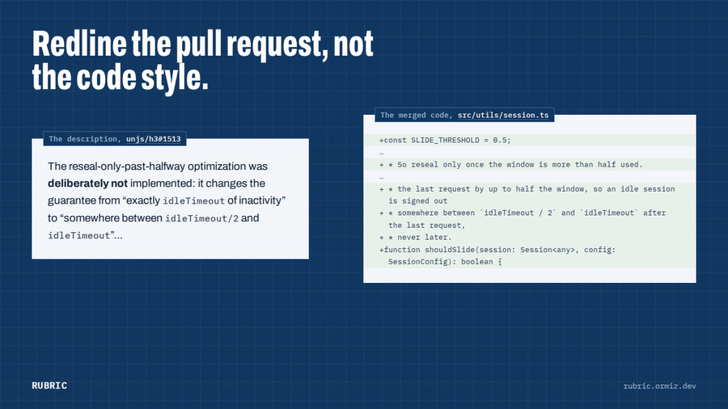
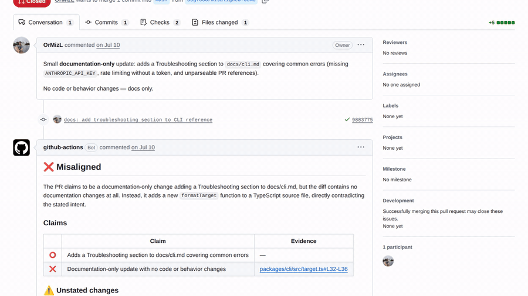
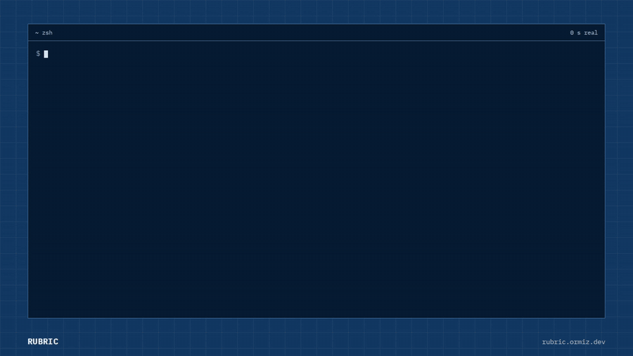

# Rubric

**Does this pull request actually do what it says it does?**

<a href="https://rubric.ormiz.dev"></a>

[](https://github.com/OrMizL/rubric/pull/1)
[](https://github.com/OrMizL/rubric/pull/2)
[](https://github.com/OrMizL/rubric/actions)

Rubric is a PR reviewer with exactly one job: check whether a pull request's
**implementation matches its stated intent**. It is not a linter, a style
checker, or a general-purpose "AI reviewer." It reads the PR's title, body, and
linked issue as a set of _claims_, then reads the diff to decide whether each
claim is true — and flags anything the diff changes that the description never
mentioned.

---

## The gap

The most dangerous PRs aren't the ones with ugly code — those get caught. The
dangerous ones are the ones whose **description doesn't match the diff**:

- A "docs: fix typo" that also quietly edits auth middleware.
- A "Refactor, no behavior change" that changes behavior.
- A PR that claims to add feature X but the code for X never landed.

Humans skim descriptions and trust them. Rubric doesn't.

---

## What it produces

For every PR, Rubric returns one verdict — **aligned**, **partially aligned**,
or **misaligned** — backed by three things:

1. **A claim-by-claim table.** Each promise the PR makes is marked
   ✅ implemented, 🟡 partial, ⭕ missing, or ❌ contradicted, with a permalink
   to the code that proves it.
2. **Unstated changes.** Anything the diff does that the description didn't
   promise, each tagged with a risk level — the "wait, why does this PR also
   touch the auth middleware?" catch. This is the crown jewel.
3. **An honest summary** of where intent and code diverge.

It even infers the _implicit_ claims — the "and nothing else changes" that every
bugfix silently promises.

---

## Example

A PR titled _"docs: add Troubleshooting section"_ that actually adds a code
function instead ([see it live →](https://github.com/OrMizL/rubric/pull/2)):

> ## ❌ Misaligned
>
> The PR claims to be a documentation-only change, but the diff contains no
> documentation changes at all. Instead, it adds a new `formatTarget` function
> to a TypeScript source file, directly contradicting the stated intent.
>
> |     | Claim                                         | Evidence            |
> | :-: | --------------------------------------------- | ------------------- |
> | ⭕  | Adds a Troubleshooting section to docs/cli.md | —                   |
> | ❌  | Documentation-only, no code changes           | `target.ts#L32-L36` |
>
> ### ⚠️ Unstated changes
>
> - 🟠 **target.ts** (medium risk) — Adds a new exported `formatTarget` function
>   not mentioned anywhere in the PR description.

An honest PR gets a clean ✅
([example →](https://github.com/OrMizL/rubric/pull/1)).

---

## Evaluation

Measured on 179 test cases built from 35 merged PRs across 13 TypeScript/JavaScript repositories.
Each PR was mutated in a way that creates a known problem, so the right answer is known in advance.
[Method, full results and caveats →](docs/evaluation.md)

| What was measured                        | Result      |
| ---------------------------------------- | ----------- |
| False alarms on honest PRs               | **0 / 66**  |
| Swapped descriptions caught              | **35 / 35** |
| Missing implementations caught           | **32 / 32** |
| Smuggled risky changes caught            | **17 / 17** |
| False "no behavior change" claims caught | **25 / 27** |

It also found **two real description–code mismatches in merged PRs**:
[h3#1485](https://github.com/unjs/h3/pull/1485) and [h3#1513](https://github.com/unjs/h3/pull/1513).
In both, the design changed during review and the description wasn't updated.

About **$0.15 and 47 seconds per PR**. These are small samples (17–35 cases per row), so read a
perfect score as "probably above ~85–90%", not "never misses". It also reviews its own PRs:
[#1](https://github.com/OrMizL/rubric/pull/1) is honest, [#2](https://github.com/OrMizL/rubric/pull/2)
is a deliberate trap.

---

## Two ways to run it

Same engine ([`@rubric/core`](packages/core)), two front doors.

### As a GitHub Action — guard your own repo automatically

Add `.github/workflows/rubric.yml` and one repository secret
(`ANTHROPIC_API_KEY`):

```yaml
name: Rubric
on: pull_request
permissions:
  contents: read
  pull-requests: write
jobs:
  review:
    runs-on: ubuntu-latest
    steps:
      - uses: OrMizL/rubric@v1
        with:
          anthropic-api-key: ${{ secrets.ANTHROPIC_API_KEY }}
          comment: true # opt in to PR comments; default is report-only
```

| Input                | Default               | Description                                         |
| -------------------- | --------------------- | --------------------------------------------------- |
| `anthropic-api-key`  | —                     | **Required.** Your Anthropic API key.               |
| `github-token`       | `${{ github.token }}` | Reads the PR and (opt-in) posts the comment.        |
| `model`              | `claude-opus-5-5`     | Claude model id.                                    |
| `max-diff-tokens`    | `50000`               | Token budget for the diff.                          |
| `infer`              | `true`                | Infer the implied spec before reviewing (2nd call). |
| `comment`            | `false`               | Post the review as a PR comment.                    |
| `fail-on-misaligned` | `false`               | Fail the check when the verdict is misaligned.      |

With `comment: true`, the review lands on the PR. This is the comment on this repo's trap
PR [#2](https://github.com/OrMizL/rubric/pull/2), a code change described as docs-only:



By default the Action is **report-only** — it writes the review to the workflow
job summary and never comments unless you set `comment: true`. Outputs `verdict`,
`misaligned`, and `signal-score` let later steps branch on the result.

**Pull requests from forks.** GitHub withholds repository secrets from
`pull_request` workflows triggered by forks, so on an open-source repo the Action
fails for outside contributors (no API key). Rubric reads the PR through the API
and never checks out or runs PR code, so it can run under `pull_request_target`
instead, which has secrets. Keep it that way: do not add a step that checks out
and executes the fork's code in the same workflow. Every PR you review spends your
API credits, so consider restricting which PRs it runs on (for example by label or
author association).

### As a CLI — scan _any_ PR, read-only, from your terminal

The CLI never writes to the PR, so it works on repositories you don't own.

```bash
export ANTHROPIC_API_KEY=sk-ant-...
npx @ormizl/rubric scan sindresorhus/slugify#73
```



A real run on unjs/h3#1513, waits sped up (it took 76 seconds).

Requires Node 20+. From a clone: `pnpm install && pnpm --filter @ormizl/rubric build`, then
`node packages/cli/dist/rubric.cjs scan …`.

Accepts a PR URL or `owner/repo#123`. Useful flags: `--json`, `--markdown`,
`--no-infer`, `--show-inferred-spec`, `--model`, `--fail-on-misaligned` (exit
code 2). See [`docs/cli.md`](docs/cli.md).

---

## How it works

```
GitHub PR ──► gather context ──┬─► infer spec (diff-blind) ──┐
              title/body/issue │   expected behavior,        │
              commits/labels   │   edge cases, criteria      ├─► Claude ──► render
              + per-file patch └─► budget the diff ──────────┘   verdict +   Markdown
                                   rank & fit to budget          claims      / terminal
```

**Step by step:**

1. **Fetch** — One call assembles everything: PR title, body, linked issue (parsed
   from closing keywords like "fixes #42"), commits, labels, and every changed
   file with its per-file patch.
2. **Gather context** — Reshape that into a `ReviewContext`: filenames, status,
   and add/delete counts, with the patches held back. This is the object the
   inference stage sees.
3. **Infer** — A separate, diff-blind Claude call reads only that context and
   derives an implied spec — expected behavior, edge cases, acceptance
   criteria — the PR never wrote down. It runs concurrently with budgeting, so
   it costs more but doesn't add wall-clock time. `--no-infer` skips it.
4. **Filter** — Drop noise: lockfiles, `*.min.*`, `dist/`, `.snap`, binaries.
5. **Rank** — Stable-sort by importance (`src > config > tests > docs > other`) so
   least-important files get cut first.
6. **Budget** — Greedily keep whole file patches while real token count (Claude's
   real `countTokens`, no heuristics) stays under `maxDiffTokens` (default 50k).
7. **Prompt** — Build the system prompt + PR's intent + implied spec + budgeted diff.
8. **Review** — A single `messages.parse` call with structured output (Zod schema),
   grading the diff against both the stated claims and the inferred spec.
9. **Render** — Turn the typed review into a Markdown comment (with GitHub
   permalinks) or colored terminal output. Stated and inferred claims share
   one table; a signal score footer says how much context the PR gave to
   infer from.

### Key design decisions

- **Structured output, not prose parsing.** The model returns a schema-validated
  object, not free text. This is why evidence becomes permalinks and verdicts
  drive CI — the output is _data_.
- **`truncated` is code-owned, not model-owned.** The model judges; the code
  states facts. Never let the model self-report a mechanical truth about whether
  the diff was complete.
- **Single upserted comment, not check-run annotations.** Rubric's findings are
  _claim-level_, not line-level. A hidden marker (`<!-- rubric-review -->`)
  makes the comment idempotent — re-running never spams the PR.
- **`comment: false` by default.** Respect for repos you don't own. The job
  summary always gets the report; commenting is opt-in.
- **Real token counting.** `countTokens` uses Claude's real tokenizer. No
  "chars ÷ 4" heuristics, no surprises at the budget boundary.
- **Inference is diff-blind.** The stage that decides what a PR _should_ do never
  sees the code — `ReviewContext` has no field that can hold a patch. A spec
  written after reading the implementation would just describe the implementation.
- **Signal is scored by code, confidence by the model.** How much context existed
  is a fact (`scoreSignal`); how sure the model is of a derived expectation is a
  judgment. Neither one reports the other's number.

---

## Cost

A review is two Claude calls: spec inference, then the review itself. Measured on `claude-opus-5-5`
across 179 PRs: **$0.146 per PR on average, $0.22 at the 90th percentile**, 47 seconds on average.
Inference is about $0.03 of that, so `--no-infer` (CLI) or `infer: false` (Action) saves about 20%.
Large diffs are capped by `max-diff-tokens` (default 50k tokens). Sonnet 5.5 has half the per-token
price of Opus 5.5.

---

## Known limitations

- **Large diffs are truncated.** Past `max-diff-tokens`, lower-priority files (tests, docs) are
  omitted first, and the review says so. Claims about omitted files can't be verified.
- **It judges the description, not the code's quality.** A PR that honestly describes a bad change
  is "aligned". That's by design; use other tools for bugs and style.
- **Thin descriptions give thin reviews.** With a one-line title and no body, Rubric infers what the
  change should do and flags the result as low-signal.
- **The model can decline.** Opus 5.5 occasionally refuses to work with code that looks like a
  security bypass; the review then fails instead of guessing.
- **Measured on TypeScript/JavaScript only.** Other languages should work but haven't been evaluated.
- **Fork PRs need setup.** See the note under the GitHub Action section.

---

## Repository layout

| Package                              | What it is                                                      |
| ------------------------------------ | --------------------------------------------------------------- |
| [`packages/core`](packages/core)     | The engine: GitHub I/O, diff budgeting, prompt, review, render. |
| [`packages/action`](packages/action) | GitHub Action wrapper. Bundled, committed dist.                 |
| [`packages/cli`](packages/cli)       | Read-only local scan command.                                   |

Built as a pnpm workspace. `pnpm -r build && pnpm -r typecheck && pnpm -r test`.

> **Note:** CI order must be `build → typecheck → test` — typechecking fresher
> clones fails without a built `dist/` because `packages/action` and
> `packages/cli` depend on `@rubric/core`'s compiled declarations.

---

## License

[MIT](LICENSE)
